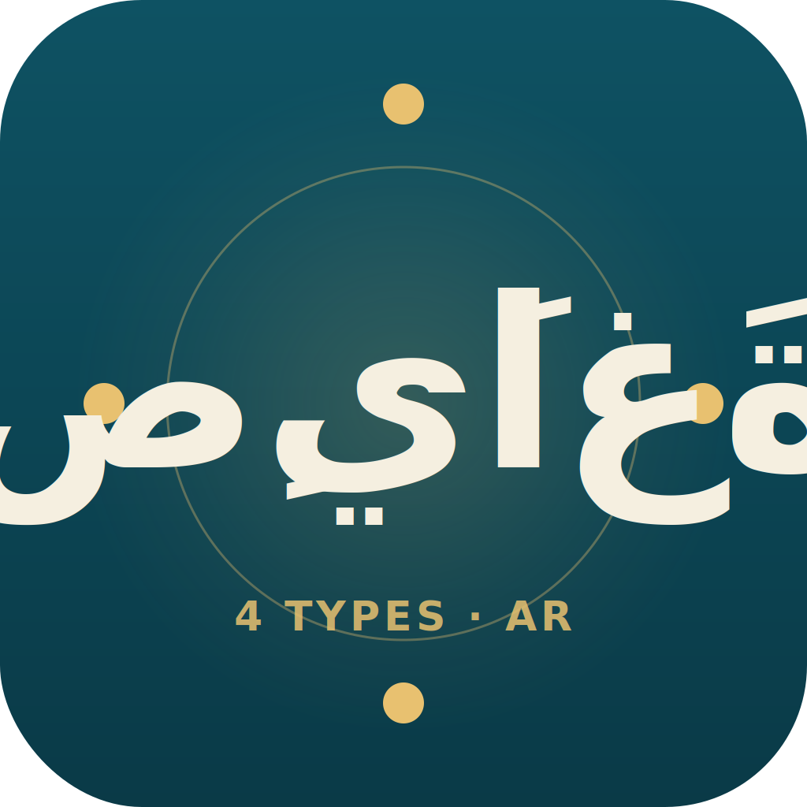

<p align="center">
  
</p>

# جناح التأليف العربي

> 🇬🇧 [English README](README.md) — هذا الملف هو النسخة العربية، صياغةً بالعربية الفصحى لا ترجمةً حرفية.

مهارةُ تأليفٍ عربيٍّ طويلِ النَّفَس (كتب، مقالات، دورات، أخبار) بانضباطِ **حزمةِ الحقائق** الإلزامي. الفكرةُ المركزية من مراجعةٍ متعدِّدةِ الوكلاء: التأليفُ الساذجُ بالنموذج اللغوي يُنتج البصمةَ الآليةَ ذاتَها التي صُمِّم المؤنسِنُ لتنظيفها؛ والحلُّ هو تأسيسُ التأليف على المُدوَّنة **من مرحلة المُخطَّط**، لا من مرحلة النثر. تَعتمد على [`arabic-corpus-toolkit`](https://github.com/drxvb/arabic-corpus-toolkit) و[`arabic-ai-text-humanizer`](https://github.com/drxvb/arabic-ai-text-humanizer). مبنيةٌ على مواصفات [Agent Skills](https://agentskills.io).

## ما الذي يَشحَنه v1.8.0

- **التوليدُ المُخطَّطُ أولًا** — `generate()` يُسوِّد كلَّ قسمٍ انطلاقًا من مُخطَّطٍ مُعتمَد؛ والمطالباتُ من سطرٍ واحدٍ **مرفوضة**.
- **التحقُّقُ المُسبَقُ من حزمة الحقائق** — `validate_fact_pack()` يَرفُض المُوجزاتِ غيرَ المؤسَّسةِ **قبل** إنفاق أيِّ رموز (`refusal_reason: fact_pack_validation_failed`، مع تشخيصِ تغطيةٍ لكلِّ ادِّعاء).
- **بوَّابةُ المؤنسِنِ الحاجزة** — `humanizer_gate_block=True` (افتراضيًّا) تَرفُض المُخرَجَ كاملًا حين يَفشَل أيُّ قسمٍ في عتبة البشَرية بعد `max_regen_per_section` (`refusal_reason: humanizer_gate_failed`، مع درجةِ كلِّ قسمٍ فاشلٍ وعتبتِه ومحاولاتِه). بهذا صار ميثاقُ «المؤنسِنُ بوَّابةٌ لا صَقْل» مُنفَّذًا بِنيويًّا.
- **سياساتُ سجلٍّ لكلِّ نوع** — كتاب / مقال / دورة / خبر، لكلٍّ عتبتُه وميزانيةُ طولِه وقواعدُ حقائقِه.
- **ترشيحُ `min_consensus`** — حصرُ مصطلحات الأصل G في ما صادَق عليه أغلبيةُ المزوِّدين أو إجماعُهم.
- **سجلُّ الأثر G3** — كلُّ مصطلحٍ من الأصل G يُحقَن في مطالبةِ قسمٍ يُسجَّل سببيًّا.

## أنواعُ المحتوى الأربعة

| النوع | السجل | ميزانيةُ الطول | شرطُ حزمةِ الحقائق |
|---|---|---|---|
| **فصلُ كتاب** | كلاسيكي / رأي | ٣٬٠٠٠–٨٬٠٠٠ كلمة | ببليوغرافيا ≥ ١٠ مصادر؛ ٤–٨ أقسام |
| **مقال** | إخباري / رأي | ٥٠٠–٢٬٥٠٠ كلمة | مصادر ≥ ٣؛ ٢–٤ أقسام |
| **وحدةُ دورة** | تقني / رأي | ١٬٥٠٠–٤٬٠٠٠ كلمة | أهدافُ تعلُّمٍ + متطلَّباتٌ سابقة + بنكُ تمارين |
| **قطعةٌ إخبارية** | إخباري | ٢٠٠–٨٠٠ كلمة | مصدرٌ أوَّليٌّ ≥ ١؛ من + ماذا + متى + أين + لماذا + كيف |

## ميثاقُ الرفضِ أولًا — الرفضُ هو المُنتَج

```bash
# يُرفَض (لا حزمةَ حقائق):
python scripts/author.py --type article --topic "رؤية ٢٠٣٠"
# المُخرَج: "REFUSED: --type article requires --fact-pack <path>."

# يُرفَض (مصادرُ فصلِ الكتاب أقلُّ من ١٠):
python scripts/author.py --type book-chapter --fact-pack ./brief.md

# يَمضِي:
python scripts/author.py --type article --fact-pack ./brief-with-sources.md \
    --outline-file ./outline.json --output article-ar.md
```

## التحقق من سلامة التثبيت

```bash
python evals/test_fact_pack_validator.py   # ١٤ — مُدقِّقُ حزمةِ الحقائق
python evals/test_gate_block_contract.py   # ١٦ — رفضُ حزمةِ الحقائق + رفضُ بوَّابةِ المؤنسِن الحاجزة
python evals/test_refusal_contract.py      # ١٥ — ميثاقُ الرفضِ أولًا + عتباتُ المصادرِ لكلِّ نوع
```

جميعُها حتميةٌ بلا أيِّ نداءٍ حيٍّ لنموذجٍ لغوي.

## النطاق

مُؤلِّفٌ، **ليس** مُعيدَ صياغةٍ للنثر (استخدم المؤنسِن)، ولا مترجمًا (استخدم المترجم)، ولا أداةَ مقتطفاتٍ لوسائل التواصل، ولا مُولِّدًا بلا حزمةِ حقائق (مرفوض). تاريخُ الإصدارات الكاملُ في [`CHANGELOG.md`](CHANGELOG.md).

## الترخيص

[MIT](LICENSE). حقوق النشر © ٢٠٢٦.
